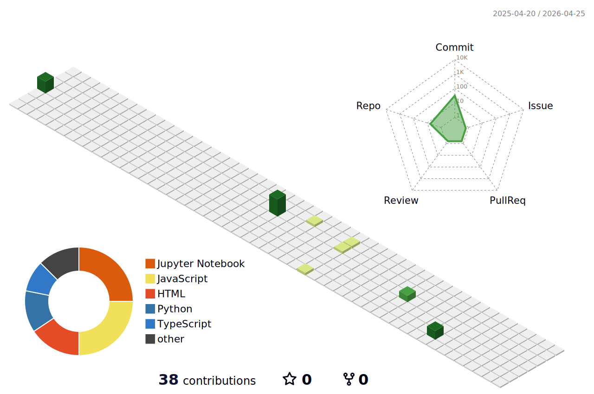

# Hi, I'm Mahak Gupta 👋
---------------------------------------------------------------------------------------------------------------------------------------
### 🎓  MS Data Analytics @ SJSU | 📊 Data Engineering & AI Aspirant | 🌐 Actively Building Intelligent Systems
---------------------------------------------------------------------------------------------------------------------------------------
- 💼 Data Analytics Graduate Student & Full-Stack Engineer with experience in banking analytics, cloud infrastructure, and data-driven systemss
- ⚙️ Tech Stack: Python, Java, JavaScript, SQL | Airflow, Kafka, Docker, Snowflake, GCP, AWS
- 🌱 Focus Areas: Machine Learning, Data Engineering, Agentic AI, Scalable Data Pipelines
- 💡 Hands-on Projects: RAG-based AI Concierge, Yelp Data Warehouse, Stock Analytics Tools
- 🧠 Fun Fact: From banking analytics to scalable tech systems, my journey shaped a strong passion for data, engineering, and intelligent decision-making 🚀

### 🧠 Data Science & AI Libraries Frameworks

### 🗄️ Data & Vector Stores

### 🧩 Databases

### 🛠️ Tools & Platforms

## ⚙️ Tech Stack

Click to expand (Data Engineering, Cloud, Full Stack)

### 🔹 Data Engineering
- Airflow, Kafka, ETL Pipelines
- Snowflake, BigQuery, MongoDB

### 🔹 Cloud
- AWS (Lambda, S3, Glue)
- GCP

### 🔹 Backend
- Python, Java, Node.js, FastAPI

### 🔹 Frontend
- JavaScript, HTML/CSS, React

### 🔹 DevOps
- Docker, CI/CD, Kubernetes

### GitHub Stats

### Top Languages

### 3D Contribution Graph

