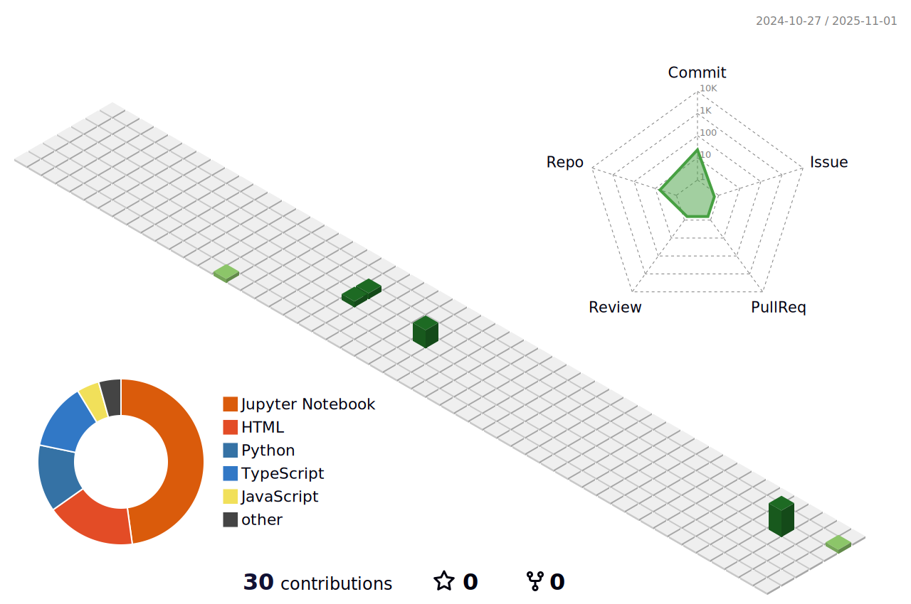

# Hi, I'm Mahak Gupta 👋 

- MSDA @ SJSU · Data Engineering & AI projects
- Building: Kafka→MySQL→Vertica→Superset, Airflow→GCS→BigQuery, etc.
- Open to Data Eng / Analytics Internships

### Tech & Tools
Python · SQL · Airflow · Kafka · Snowflake · BigQuery · FastAPI · React

### GitHub Stats

### Top Languages

### 3D Contribution Graph

